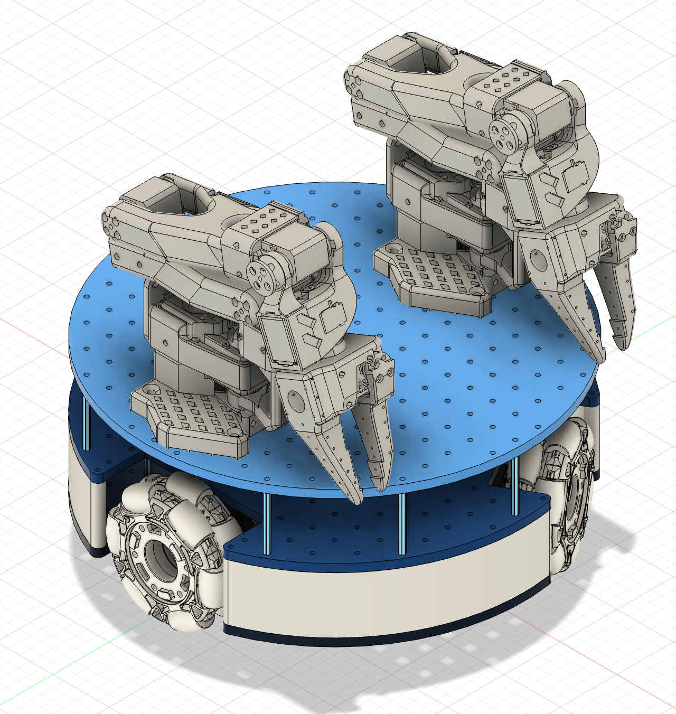
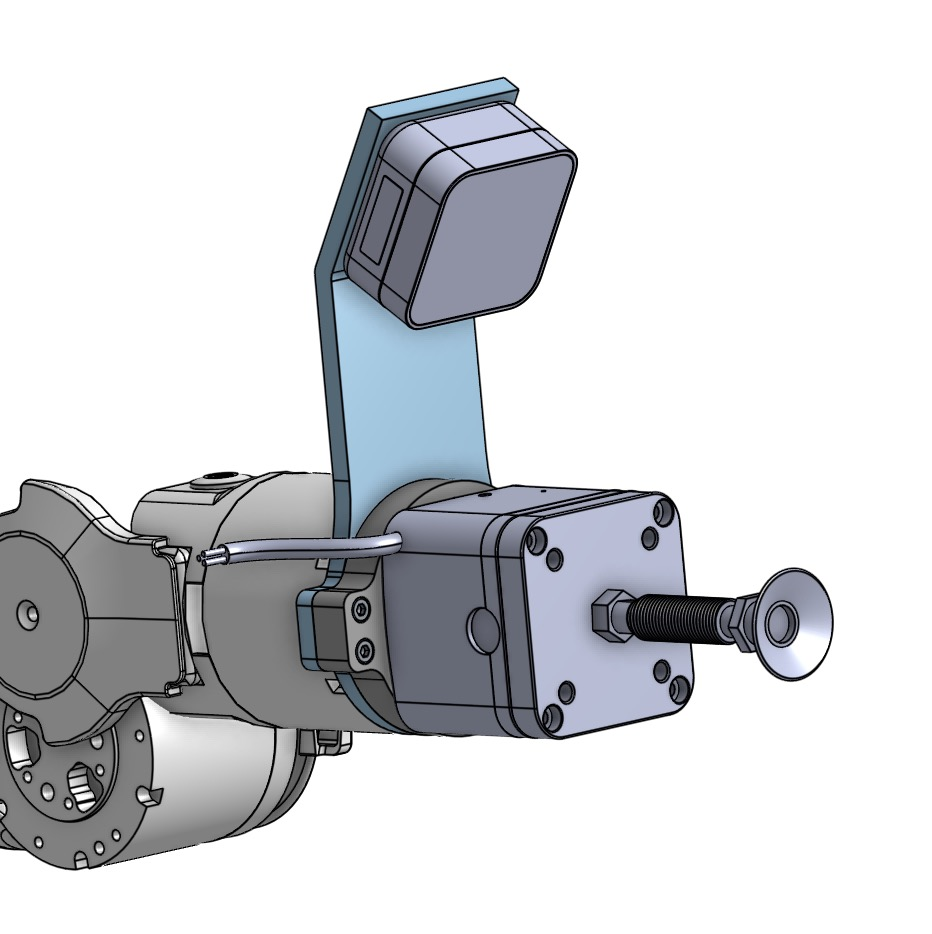
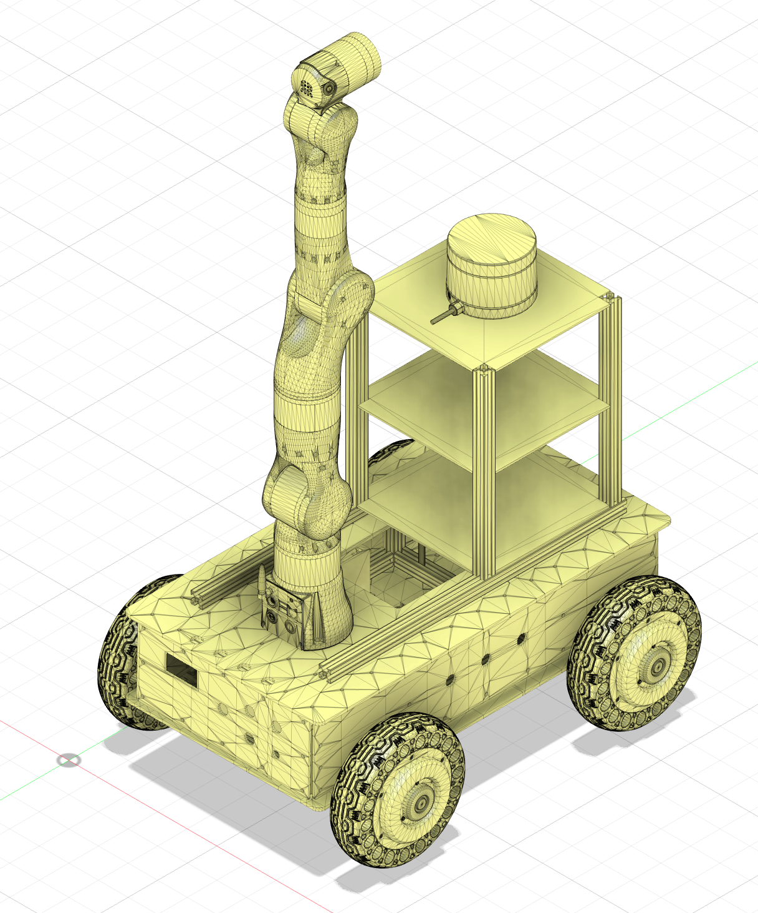
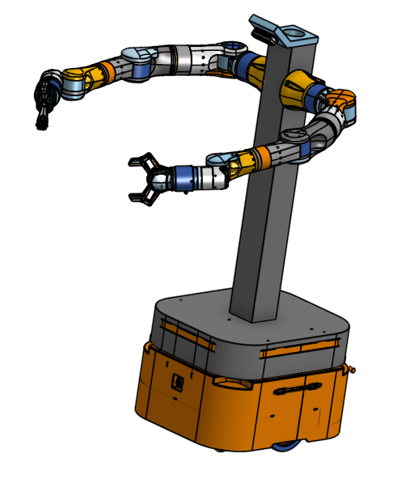

# Project-ADORA: Mobile Humanoid Robots

## Project Overview

This repository documents my internship work on **Project-ADORA**, a series of open source mobile humanoid robots utilizing the dora-rs software framework. The project encompasses the design and development of three robot variants: ADORA Nano, ADORA MAX, and ADORA Pro.

**Project Focus:** Mechanical design

---

## Major Contributions & Outputs

### ADORA Nano: Dual-Arm Mobile Platform

**Design Objective:** Create a compact mobile robot capable of bimanual manipulation tasks

**Key Outputs:**
- **Mobile base design** bottom and upper plate for motor, two HuggingFace LeRobot SO-ARM101 robotic arms
- **Custom OrangePi mount** for onboard computing integration
- **Dual-arm mounting system** with optimized spacing and cable management
- Complete CAD assembly with bill of materials

---

### ADORA MAX: Mobile Platform with Pivoting Head

**Design Objective:** Enhance environmental perception through dynamic camera positioning

**Key Outputs:**
- **Pivoting "head" mechanism design** with multi-axis movement capability
- **Gemini 335 depth camera mount** for 3D perception
- **Pan-tilt system** for active vision and scene understanding
- Mechanical drawings

---

### ADORA Pro: Professional 6-Axis Robotic System

**Design Objective:** Develop a mobile manipulation system with lidar and stereo vision

**Key Outputs:**

- **Custom D405 stereo camera mount** designed for Realman RM65-B robotic arm and Agilex Piper arm
- **Minimal interference design** maintaining full arm workspace
- **Blueprint for 4-wheel mobile base** with single 6-axis arm
- **RM65 arm mounting system** with optimal positioning
- Mechanical drawings

